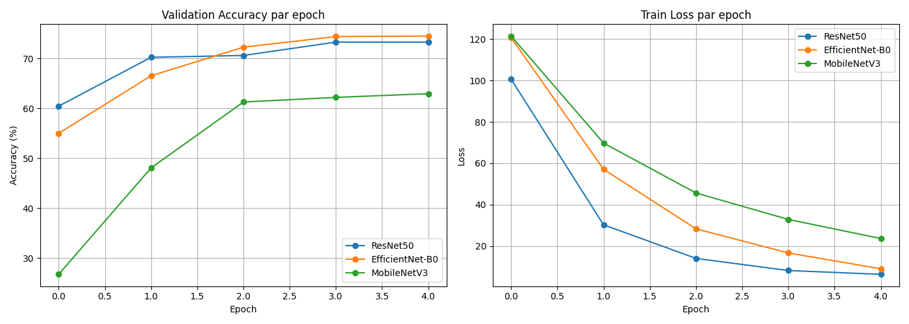
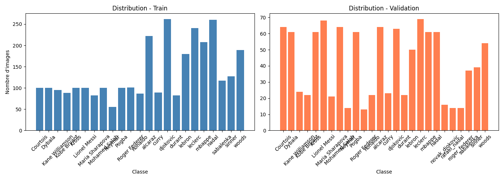

---

## ⚽ Bloc 3 — Prédiction Ligue 1 (XGBoost)

### Objectif
Prédire le résultat d'un match de Ligue 1 (victoire domicile,
nul, victoire extérieur) à partir de données statistiques.

### Modèle utilisé
- **XGBoost** (Gradient Boosting)

### Fichiers
| Fichier | Description |
|---|---|
| `main.py` | Script principal d'entraînement et prédiction |
| `test.py` | Tests unitaires |
| `requirements.txt` | Dépendances Python |

### Installation
```bash
cd bloc3-ligue1-prediction
pip install -r requirements.txt
python main.py
```

---

## 🏅 Bloc 5 — Classifier d'Athlètes (Deep Learning)

### Objectif
Classifier des images d'athlètes selon leur sport
grâce à un réseau de neurones convolutif.

### Modèle utilisé
- **ResNet50** (Transfer Learning, PyTorch)
- Comparaison avec EfficientNet-B0 et MobileNetV3

### Fichiers
| Fichier | Description |
|---|---|
| `exploration_donnees.py` | Analyse exploratoire du dataset (EDA) |
| `comparaison_modeles.py` | Benchmark ResNet50 vs EfficientNet vs MobileNet |
| `train.py` | Entraînement du modèle final ResNet50 |
| `predict.py` | Prédiction sur une image |
| `main.py` | API de classification |
| `Dockerfile` | Conteneurisation Docker |
| `requirements.txt` | Dépendances Python |

### Résultats



### Installation
```bash
cd bloc5-athlete-classifier
pip install -r requirements.txt
```

> ⚠️ Le fichier `sports_model.pth` (modèle entraîné, 92 Mo) n'est pas
> inclus dans ce repo. Il peut être fourni sur demande ou recréé
> en lançant `python train.py` avec le dataset.

### Lancer la prédiction
```bash
python predict.py --image chemin/vers/image.jpg
```

### Lancer avec Docker
```bash
docker build -t athlete-classifier .
docker run -p 8000:8000 athlete-classifier
```

---

## 🛠️ Technologies utilisées

- Python 3.10
- PyTorch / Torchvision
- XGBoost
- Scikit-learn
- Pandas / NumPy / Matplotlib
- Docker
- FastAPI

---
### Dataset
Le dataset est disponible sur Kaggle :
🔗 [Athlete Image Classification Dataset](https://www.kaggle.com/datasets/alexsponsoos/athlete-image-classification-datase)

### Installation & Setup
```bash
cd bloc5-athlete-classifier
pip install -r requirements.txt
```

Télécharger le dataset via Kaggle API :
```bash
pip install kaggle
kaggle datasets download -d alexsponsoos/athlete-image-classification-datase
unzip athlete-image-classification-datase.zip -d dataset/
```

Puis entraîner le modèle :
```bash
python train.py        # génère sports_model.pth
python main.py         # lance l'API
```
